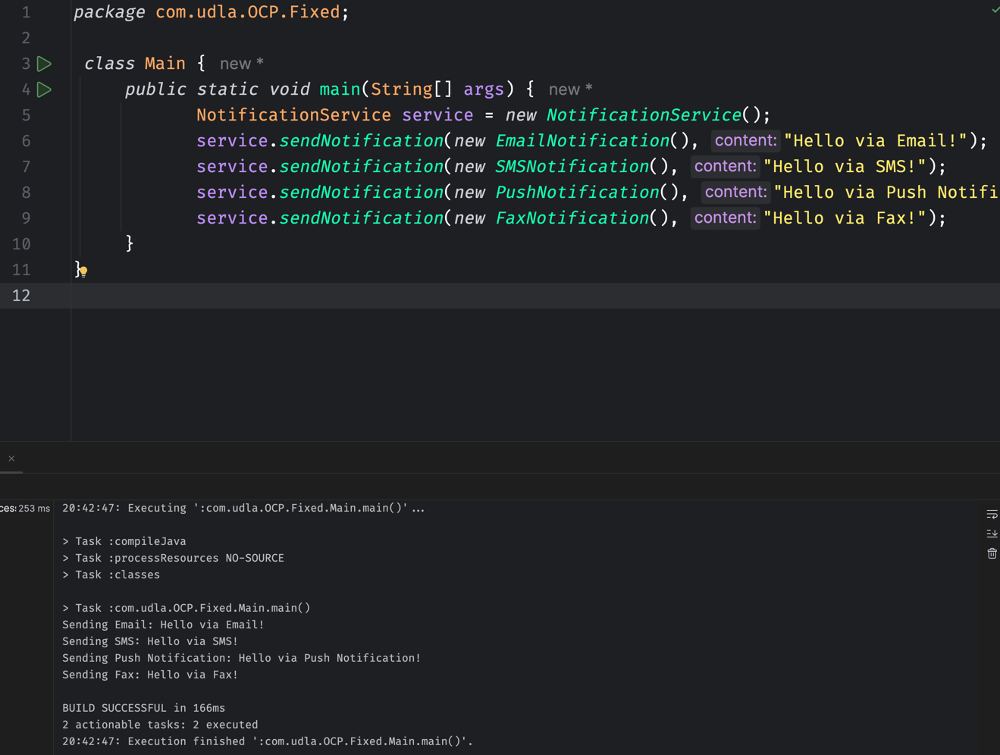

# Principios SOLID
## Single Responsability Principle
Aquí se demuestra el principio de responsabilidad única, donde cada clase tiene una única responsabilidad.

</img>
### Reflexiones
- De esta forma podemos tener un código más limpio y mantenible, a través de la separación de responsabilidades.
- Se puede tener un código más fácil de probar, ya que al tener una única responsabilidad, se pueden realizar pruebas unitarias de forma más sencilla.

## Open/Closed Principle
Este principio establece que una clase debe estar abierta para extensión, pero cerrada para modificación. Es decir, que una clase debe poder ser extendida sin necesidad de modificar su código fuente.
</img>

### Reflexiones
- Este principio nos permite tener un código más robusto y menos propenso a errores.
- Nos permite tener un código más mantenible, ya que al no tener que modificar el código fuente, se evitan errores en otras partes del código.
- Nos permite tener un código más escalable, ya que se pueden añadir nuevas funcionalidades sin tener que modificar el código fuente.