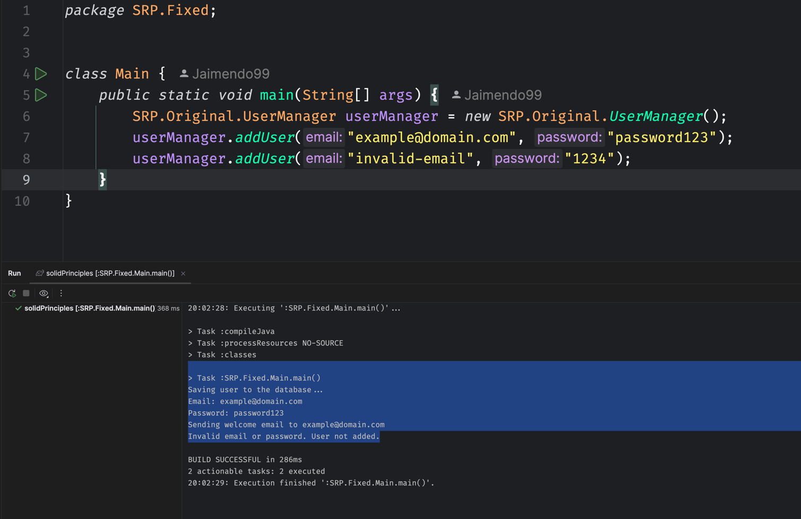

# Principios SOLID
## Single Responsability Principle
Aquí se demuestra el principio de responsabilidad única, donde cada clase tiene una única responsabilidad.

</img>

De esta forma podemos tener un código más limpio y mantenible, a través de la separación de responsabilidades.